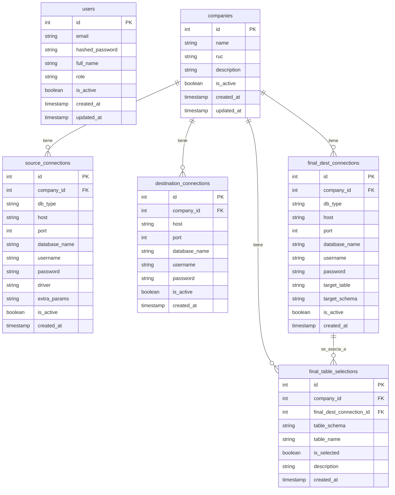
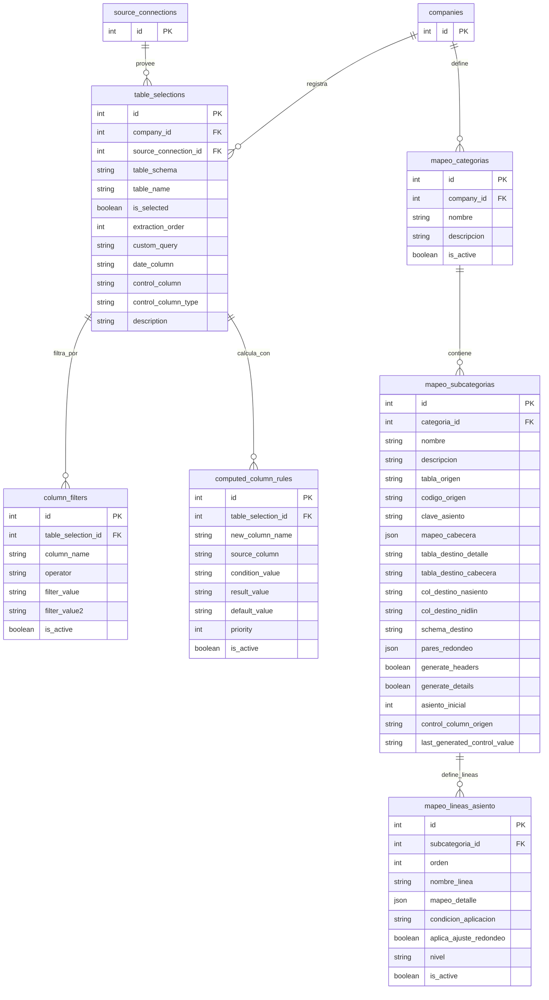
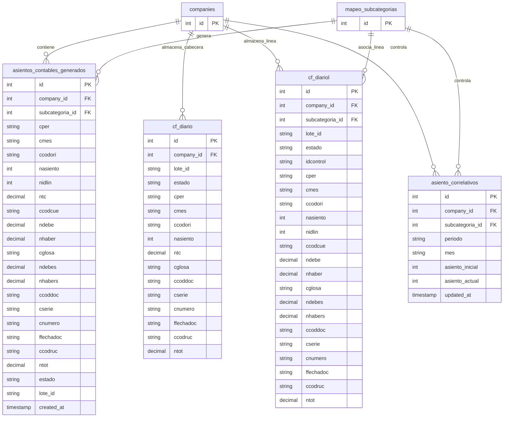
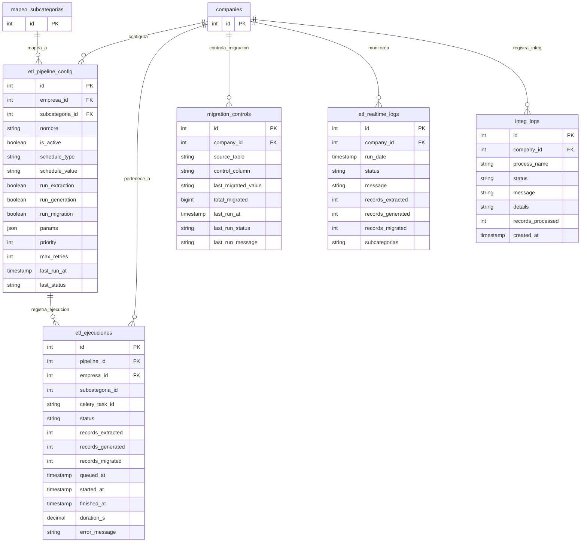
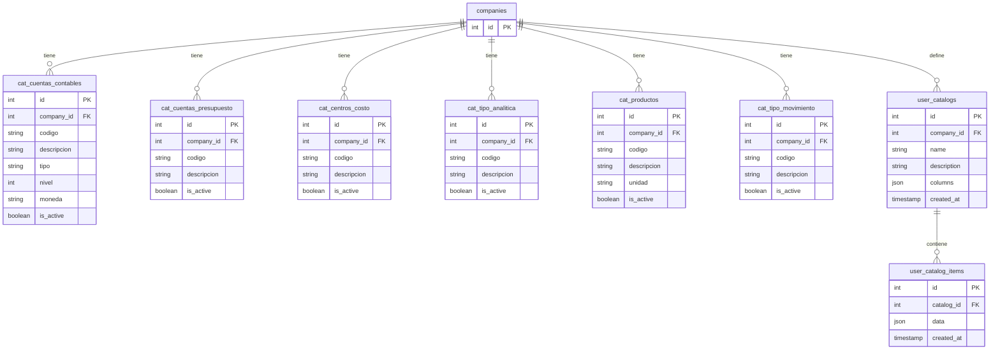

# Diagrama Entidad-Relación - SistemaMigConta

Este documento presenta los diagramas de entidad-relación (ER) para la base de datos `migconta_db` del proyecto. Dado que la base de datos cuenta con más de 50 tablas, el diagrama se ha dividido en módulos lógicos para facilitar su visualización y comprensión.

Puedes ver la renderización gráfica de estos diagramas abriendo la vista previa de Markdown en tu IDE (VS Code u otro compatible con Mermaid).

---

## 1. Módulo Central (Empresas, Usuarios y Conexiones)
Este módulo gestiona los usuarios del sistema, las empresas registradas y las credenciales/conexiones a las bases de datos de origen (SQL Server), intermedia (PostgreSQL) y destino final (Contasis).

---

## 2. Módulo de Configuración de Extracción y Mapeos
Controla las tablas de origen que se extraerán de SQL Server, los filtros de columnas aplicados, las columnas calculadas tipo Excel y las reglas de mapeo contable para generar asientos.

---

## 3. Módulo de Asientos Contables y Staging (Destino Contasis)
Representa el proceso en el cual los datos procesados son convertidos a asientos contables en la estructura exacta requerida por la base de datos de Contasis.

---

## 4. Módulo de Pipelines ETL, Automatizaciones y Logs
Gestiona la ejecución automática de los pipelines ETL utilizando Celery/Redis, el control incremental y el registro histórico/tiempo real de logs.

---

## 5. Módulo de Catálogos Contables
Agrupa los catálogos del plan de cuentas, centros de costo, productos, tipos de cambio y catálogos personalizados definidos por el usuario.

